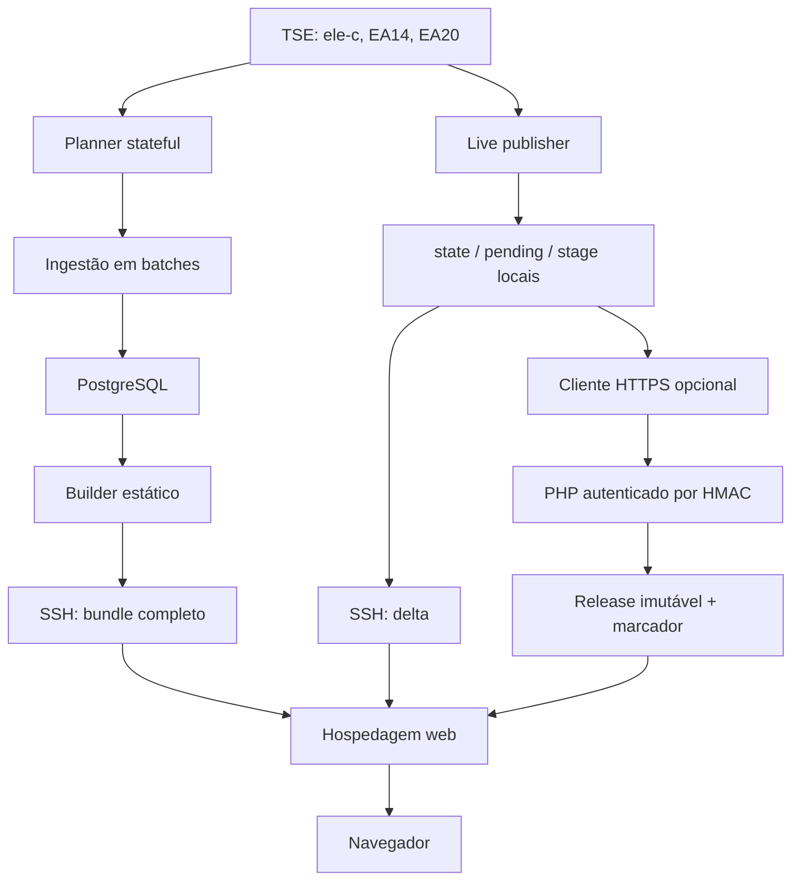
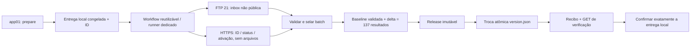

# Arquitetura atualmente implementada

## Escopo e limite das evidências

Este documento registra a implementação do checkout inspecionado, as evidências datadas da auditoria operacional e uma proposta futura claramente separada. As regras permanentes e comandos de desenvolvimento/validação estão em [AGENTS.md](AGENTS.md). O estado observado não garante disponibilidade futura.

## Política de transporte e limite desta etapa

FTP convencional, porta 21, sem FTPS, é obrigatório para uploads à Locaweb por decisão explícita do responsável. Reutilizar as três credenciais FTP existentes e reservar `LOCAWEB_FTP_GOIAS_DIR` para Goiás. Não criar credenciais duplicadas nem adotar SFTP/SCP/HTTPS para transferência. HTTPS de controle sem arquivos é proposto abaixo para preservar ativação segura.

As seções descrevem também mecanismos legados, não autorização para novos uploads por eles. A etapa 6 acrescenta implementação FTP opt-in na branch de revisão; nenhum serviço, workflow instalado ou arquivo de produção foi modificado. A migração operacional ainda não ocorreu.

A plataforma coleta e apresenta resultados disponibilizados pelo TSE. O portal se identifica como projeto independente e não realiza projeções próprias. Há também composição parlamentar e uma interface financeira de Goiás, com estados de implementação diferentes.

Fontes principais: `README.md`, módulos em `collector/src/`, migrations, scripts de deploy, workflows e frontend. `docs/https-staging-publisher.md` e comentários de alguns publicadores descrevem um estágio anterior: o receptor atual já possui uma ação oficial protegida por trava. Prevalece o comportamento confirmado no código.

## Componentes e stack

| Diretório | Responsabilidade |
| --- | --- |
| `collector/src/` | Coleta, parsing, planejamento, histórico, observabilidade e geração de arquivos. |
| `database/migrations/` | Quatro migrations PostgreSQL e registros em `schema_migrations`. |
| `web/public/eleicoes/` | HTML/CSS/JavaScript do portal, favoritos e composição. |
| `web/public/eleicoes/goias/raio-x/` | Página financeira de Goiás, contrato e documentação específica. |
| `deploy/scripts/` | Orquestração Linux, transportes e releases isoladas. |
| `deploy/locaweb/` | Receptor HTTPS PHP e helpers de ativação/snapshots. |
| `deploy/systemd/`, `deploy/env/` | Serviços, timers e exemplo de configuração. |
| `.github/workflows/` | Cinco workflows de teste, validação e deploy. |
| `tests/`, `docs/` | Testes e documentação operacional. |

Na inspeção, `infra/` estava vazio. Não foram encontrados Dockerfile, IaC, Kubernetes ou API dinâmica de consulta de resultados. O site lê arquivos estáticos, não consulta o banco.

Stack: Python (3.13 no CI), Requests, psycopg 3, python-dotenv, PostgreSQL 15 Alpine no Compose, pytest/pytest-cov/unittest, Bash, systemd, SSH/tar, PHP, HTML/CSS/JavaScript e SVG. Node é usado para validação sintática. As dependências Python são intervalos em `collector/requirements*.txt`, sem lockfile.

## Visão de comunicação

Os caminhos histórico e live são independentes. O live não grava seus resultados no PostgreSQL. Logo, a atualização do site pode preceder ou divergir do histórico coletado.

## Integração com o TSE

`runtime.py` lê `TSE_BASE_URL`, `TSE_ENVIRONMENT`, `TSE_CYCLE` e `TSE_ROUND`. Defaults: simulado, ambiente `simulado2026`, ciclo `ele2026` e primeiro turno.

- `ele-c.json`: configuração, eleições, turnos e cargos (`runtime.py`, `discovery.py`).
- EA14: acompanhamento por abrangência, usado para descobrir localidades e detectar mudanças (`planner.py`, `change_detection.py`).
- EA20: resultados por eleição/localidade/cargo (`discovery.build_ea20_url`, `parser.parse_ea20`).

A seleção admite tipos de eleição 1 e 8. Cargos publicados: 1 presidente, 3 governador, 5 senador, 6 deputado federal, 7 estadual e 8 distrital. As regras de abrangência incluem Brasil, UFs e Exterior para presidente; estadual exclui DF e distrital se limita ao DF. O contrato atual espera 137 targets, validado por fixture em `tests/test_discovery.py`; não é inventário de produção.

`TseClient` usa sessão Requests, timeout de conexão/leitura e GET condicional com ETag/Last-Modified. HTTP 304 preserva cache; respostas completas devem ser objetos JSON e recebem SHA-256. Não há retry HTTP explícito no cliente TSE. O parser converte números/percentuais, interpreta datas no fuso São Paulo e extrai candidatos, vagas, alocações e indicadores de totalização. Os fluxos validam a identidade do payload contra o target esperado.

## Coleta histórica e retomada

Entrada operacional: `deploy/scripts/run-collector.sh` chama `collector.src.collector_runner --execute`.

1. O runner obtém estado de observabilidade e executa ciclos limitados.
2. O planner consulta configuração e EA14, reutilizando checkpoints do banco e comparando abrangências.
3. `batch_ingest.py` cria/retoma batches por hash EA14 e seleciona itens pendentes ou em erro. Batches ativos de hashes anteriores podem ser marcados `superseded` (`ea20_batch_repository.prepare_batch`).
4. Downloads e parsing podem ocorrer em workers; gravações dos resultados e estados dos itens ocorrem pelo processo principal.
5. `repository.persist_result` grava uma transação por resultado. Estados dos itens e checkpoints usam operações separadas.
6. O batch é marcado concluído antes de salvar o checkpoint EA14; a implementação prevê retentar o checkpoint após falha (`batch_ingest.py`, bloco de `state_committed`).
7. O script decide publicação completa ou parcial, bloqueando conforme erros/health. Um marcador `publish.pending` retém a intenção após falha de publicação.

`bootstrap_missing.py` compara targets com snapshots existentes e coleta somente ausentes, sem atualizar checkpoints EA14. Os modos de inspeção dos módulos não garantem ausência de rede/banco.

## Modelo PostgreSQL

| Tabela | Dados e identidade principal |
| --- | --- |
| `schema_migrations` | Versão SQL e momento de aplicação. |
| `elections` | Código TSE, turno, ambiente; única por código/ambiente. |
| `scopes` | Abrangência, código e UF; única por tipo/código. |
| `offices` | Código do cargo, nome e vagas; código globalmente único. |
| `candidates` | Cadastro por eleição/localidade/cargo/sequência TSE, com upsert. |
| `collector_runs` | URL, status, identificadores, cache HTTP, hash e contagem. |
| `scope_snapshots` | Estatísticas por eleição/localidade/cargo/idg. |
| `candidate_result_snapshots` | Votos, percentuais e situação por snapshot/candidato. |
| `ea14_state` | Payload e cache por ambiente/ciclo/eleição/turno. |
| `ea20_batches` | Progresso e hash de origem; pending/ready/completed/superseded. |
| `ea20_batch_items` | Target, tentativas, execução e erro; pending/success/not_modified/error. |

Há chaves estrangeiras, unicidades e índices de lookup/histórico/progresso nas migrations. Migrations 002, 003 e 004 acrescentam ordem de exibição, estado EA14 e batches, respectivamente. O Compose não monta nem executa as migrations.

`repository.py` carrega dotenv e abre conexão com `POSTGRES_*`, com timeout de conexão. Não define política explícita de TLS. Persistência usa parâmetros SQL. O histórico tem limites: metadados cadastrais são atualizados, e votos/status de um snapshot existente podem receber upsert; não é um arquivo bruto imutável de todas as respostas.

## Bundles e mecanismos de publicação

### Exportação do banco e SSH completo

`static_site_builder.py` lista pares localidade/cargo no ambiente informado. `static_exporter.py` seleciona o snapshot mais recentemente capturado, sem filtro específico de ciclo/eleição/turno, e escreve JSON com substituição local por arquivo temporário.

Arquivos: `<scope>/<slug>.json`, `manifest.json` e `version.json`. Slugs estão em `OFFICE_SLUGS`. O manifest lista caminho, cargo, eleição, turno, quantidade de candidatos e identificação do snapshot. O builder do banco não gera `alerts.json` nem exporta todos os campos disponíveis no live.

`publish-results.sh` constrói e valida o bundle, envia por SSH/tar para `<destino>.new`, valida contagem remota e move diretórios. Se o movimento de ativação falhar, tenta restaurar `.old`; após sucesso remove o anterior. São dois movimentos, não uma única troca atômica de ponteiro. Não há retenção de rollback remoto após sucesso.

### Live e SSH incremental

`live_publisher.prepare()` usa `state`, `pending` e `stage` dentro de `LIVE_PUBLISH_STATE_DIR`. Recria pending/stage, descobre targets, faz downloads paralelos e mantém estado HTTP por URL. O primeiro bundle exige todos os targets; depois, falhas individuais conservam as entradas antigas e são retornadas em `errors`.

O stage inclui resultados alterados e manifest/version/alerts. `live_static.py` acrescenta alocações de vagas e indicadores como definição matemática. Alertas são derivados dos campos recebidos do TSE.

`run-live-publisher.sh` executa prepare, chama o publicador selecionado por `LIVE_PUBLISH_SCRIPT` quando existe stage e só depois chama commit. O padrão é `publish-live-results.sh`, com retries SSH e host key checking. Esse script usa `cp` nos destinos públicos, escreve manifest e version ao final e apaga o stage remoto. Não implementa troca atômica por arquivo, lock entre escritores ou rollback do delta.

`commit()` substitui o estado ativo com backup temporário para falha da operação, removido após sucesso. Não comprova por consulta pública independente que os arquivos ficaram visíveis.

### HTTPS e releases imutáveis

`publish-live-results-https.py` valida um stage existente e somente envia com `--send`. Pode retomar um batch por ID, mas considera arquivos presentes suficientes para pular upload, sem comparar seus hashes com o stage atual. Usa HTTPS, HMAC SHA-256, timestamp, nonce e uploads JSON/base64, com gzip para arquivos maiores. Não implementa retry automático de HTTP.

`election-publish.php` exige POST HTTPS e autentica o corpo exato. Usa janela de timestamp de 60 segundos e arquivo de nonce criado exclusivamente para impedir replay. Segredo e batches ficam fora do document root, em `.election-publisher`. Há validação de caminhos, tamanhos, JSON e checksums; uploads são substituídos atomicamente dentro do staging privado.

Além de health/begin/upload/inspect, o receptor contém ativação privada, construção/promoção/rollback de snapshots privados e `publish_official`. Os helpers privados não publicam em `/data`.

`publish-official-snapshot.php` exige habilitador `ENABLE_OFFICIAL_PUBLICATION`, ambiente `oficial`, versão pública oficial existente e lock próprio. Constrói uma release em `/data/releases/<hash>` e substitui `/data/version.json` com `snapshot_id` após validar os arquivos. Há checagem de versão crescente. O fluxo atual apresenta restrições de delta e repetição descritas nos riscos.

`publish-official-https.sh` permite selecionar esse transporte para um stage live. O default do script é SSH, mas a auditoria de 09/10/2026 confirmou override HTTPS no app01. A política nova exige FTP para transferência futura; a migração ainda não ocorreu.

## Frontend e funcionalidades adjacentes

`app.js` lê versão, manifest, alertas e resultado selecionado. Atualiza a cada cinco segundos, oferece seleção de UF/cargo, busca, paginação, deep links, candidatos e alocação de vagas. Se a versão contém `snapshot_id` válido, usa caminhos da release imutável; caso contrário, `/data`.

`favorites.js` persiste preferências em localStorage, mantém cache de resultados e verifica atualização enquanto o painel está aberto, também com intervalo de cinco segundos no código atual. Seu leitor continua fixo em `/data`, diferente do portal e da composição. O README ainda menciona dez segundos para favoritos.

`composition.js` lê resultados e alertas para composição parlamentar. Usa constantes de composição atual e mandatos remanescentes, além de regras manuais de substituição com busca por nome. Não é um cadastro parlamentar inteiramente coletado. A inicialização lê uma versão; não foi encontrado polling periódico equivalente ao portal nesse módulo.

O HTML do portal inclui Google Analytics. Não foi encontrada transmissão de preferências de favoritos ao backend pelo módulo correspondente; isso não elimina a integração de analytics presente na página.

O Raio-X lê `./data/go-2026.json`, exige GO/2026 e arrays de candidatos/transações, oferece filtros, métricas e grafo. O checkout local auditado não contém o JSON nem o pipeline; a main remota já continha importador e workflows financeiros na auditoria operacional. Na ausência da base, a página apresenta indisponibilidade sem inventar registros. O contrato exige IDs e fontes documentadas (`web/public/eleicoes/goias/raio-x/README.md`).

## Ambientes, serviços e CI/CD

- **Local:** Compose somente para PostgreSQL, com volume e healthcheck, porta 5432 publicada. Runtime padrão simulado. Não há serviço Compose para o coletor ou frontend.
- **Linux operacional:** unidades usam `/opt/election-results-platform`, venv, usuário `electioncollector` e `/etc/election-results-platform/collector.env`. Saída no journal, `NoNewPrivileges`, `PrivateTmp` e `ProtectHome`. Coletor tem timeout de cinco minutos; live, dois minutos. Timers usam `OnUnitInactiveSec` de dez/cinco segundos, respectivamente: o intervalo começa após a execução anterior.
- **Staging HTTPS:** releases isoladas no runner, sem alteração da árvore operacional, systemd ou hospedagem. Publicação PHP requer canal separado.
- **Produção:** destinos e credenciais são externos. A auditoria operacional abaixo confirmou serviços, transporte e release naquele instante; outros parâmetros continuam desconhecidos.

| Workflow | Comportamento implementado |
| --- | --- |
| `ci.yml` | Python 3.13, dependências, compileall e pytest em PR/push main. |
| `https-publisher-ci.yml` | Testes HTTPS, script de release/rollback isolado, lint PHP e artefato com checksums. |
| `https-staging-cd.yml` | Se habilitado, runner self-hosted app01 instala release isolada ou muda ponteiro de rollback. |
| `goias-finance-ci.yml` | Valida strings do contrato/estado vazio e sintaxe do script inline com Node. |
| `deploy-goias-ftp.yml` | Deploy do módulo Goiás por FTP porta 21 sem TLS e verificação HTTPS da página. |

Os workflows de deploy não dependem por `needs` ou `workflow_run` da aprovação dos workflows de CI. O staging copia fontes do checkout, não o artefato produzido pelo CI. `release-https-staging.sh` mantém checksums, lock e ponteiros current/previous, mas não inclui o helper oficial presente no pacote CI. O rollback fornecido é de staging, não de produção.

## Observabilidade, erros e testes

O runner emite JSON com progresso, erros, health, duração de planejamento/download/persistência e contagem de candidatos. `observability.py` fornece JSON ou uma métrica CLI sobre batches/runs. O health verifica erros, não idade da informação pública. Erros live são retornados separadamente; não alimentam o histórico PostgreSQL desse coletor.

Há testes unitários com mocks para HTTP e banco, contratos textuais do frontend e testes offline dos helpers PHP privados com arquivos temporários. A árvore inspecionada contém 33 arquivos de teste. Não foram encontrados testes de banco PostgreSQL real, E2E de navegador ou comportamento de publicação oficial. O CI oficial valida sintaxe e presença de travas por strings, o que não prova recuperação/idempotência.

Não foram encontrados agentes de métricas/alertas, backups, retenção ou provisionamento completo de infraestrutura. Isso descreve o repositório, não prova ausência desses recursos externos. `docs/tse-freshness-slo.md` propõe timestamps e medição de latência, sem demonstrar sua implantação. Cadência do timer não equivale a SLA ponta a ponta.

## Riscos pendentes

Nenhum item abaixo foi corrigido durante a documentação. Criticidade considera o impacto se o caminho afetado estiver em uso.

| Prioridade | Problema verificado ou risco condicionado | Evidência |
| --- | --- | --- |
| Alta | Vagas globais por cargo podem ser exportadas incorretamente por UF: primeiro insert prevalece. | Migration 001 `offices`; `repository.persist_result` usa `DO NOTHING`; exporter lê `o.seats`. |
| Alta | Favoritos não acompanham releases imutáveis e podem ler arquivos legados desatualizados. | `favorites.js` usa `/data/manifest.json` e `/data/${item.path}`; helper oficial só promove marcador/release. |
| Alta | Helper oficial exige todos os resultados no batch antes de usar baseline, rejeitando delta normal com `invalid_release`. | `publish-official-snapshot.php`: loop do manifest exige `is_file($src.'/'.$p)`. |
| Alta | Repetição após publicação oficial concluída é rejeitada como versão antiga; resposta perdida impede confirmação por repetição. | Helper oficial verifica `newTime <= oldTime` antes de reconhecer release publicada. |
| Alta | SSH live sobrescreve JSON público com cp, permitindo leitura parcial/mistura de versões; não há lock compartilhado entre transportes. | `publish-live-results.sh`, bloco de ativação. |
| Alta | FTP transmite credenciais/conteúdo sem TLS; deploy independente do CI e sem rollback declarado. | `deploy-goias-ftp.yml`. |
| Média | Refresh marca versão consumida antes do download do resultado; falha pode manter tela antiga até outra publicação. | `app.js`, `refreshIfChanged`. |
| Média | Exportação não delimita ciclo/eleição/turno; snapshot mais recentemente capturado pode não representar o escopo desejado. | `static_exporter.load_latest_result`. |
| Média | Contratos banco/live diferem: banco não exporta alocações/definição matemática/alerts; troca de escritor pode retirar dados. | `static_exporter.py`, `static_site_builder.py`, `live_static.py`. |
| Média | Metadados históricos mutáveis e upsert em resultado de snapshot limitam fidelidade histórica. | `repository.persist_result`, joins do exporter. |
| Média | Pendências não são reservadas com lease/lock; processos adicionais podem selecionar o mesmo trabalho. | `ea20_batch_repository.get_pending_items`. |
| Média | CD isolado não depende do CI nem usa artefato verificado; helper oficial ausente da release isolada. | Workflow staging e `release-https-staging.sh`. |
| Média | Batches/releases/histórico sem retenção automatizada encontrada podem ocupar armazenamento continuamente. | Receiver/helpers; pendências em `docs/https-staging-publisher.md`. |
| Média | Bases parlamentares e substituições manuais podem envelhecer; identidade por nome é frágil. | Constantes e `governorWinner` em `composition.js`. |
| Média | Compose publica banco em interfaces do host com credencial de desenvolvimento; exposição depende de onde for usado. | `docker-compose.yml`. |
| Média | `source_url` financeiro é escapado como HTML, mas sem validação de protocolo; risco depende da base futura. | Renderização de links no Raio-X. |
| Operacional | Live não possui a trava oficial da ingestão histórica; ausência de retries HTTP, dependências sem lock e observabilidade sem freshness. | `live_publisher.py`, `ingest._looks_official`, cliente TSE e requirements. |
| Operacional | SSH completo tem janela entre movimentos e elimina backup após sucesso; recuperação de crash não demonstrada. | `publish-results.sh`. |

O teste SSH chamado de retry seguro verifica strings, sem simular interrupção/perda de resposta (`tests/test_live_publish_script.py`). Retomada HTTPS por presença, sem hashes, requer preservar exatamente o stage original; reutilizar batch com conteúdo diferente pode misturar dados.

## Auditoria operacional de 09/10/2026

Observações somente leitura entre aproximadamente 17h38 e 17h43 de Brasília, obtidas por SSH nos servidores, GET público e consulta ao GitHub Actions:

- **Confirmado:** timers collector/live habilitados e ativos no app01; coletor terminou com código 0 e live com código 1. Override `https.conf` selecionava `publish-official-https.sh`; `PUBLISH_AFTER_COLLECT=false`.
- **Confirmado:** instalação `/opt/election-results-platform`, HEAD `c273dfcaed764a7d04564b1d053e08f599dbbb10`, diferente do checkout local `3bd84796e85e6f6919a933d14dda0d60d4febf2e`. Quatro arquivos críticos do app01 tinham hashes iguais aos locais; código PHP/frontend da Locaweb coincidiu após normalizar quebras de linha.
- **Confirmado:** ambiente oficial, ciclo `ele2026`, turno 1; state/pending/stage presentes. Destino SSH configurado: `/home/storage/4/b7/e0/afgnet1/public_html/data`. A home SSH da hospedagem era `/home/storage/4/b7/e0/afgnet1`. **Isso não confirma a raiz FTP.**
- **Confirmado:** `/data/version.json` público respondeu 200 e selecionava release `fd062ecbbafbe78ddfc240658e70525b6bf9e0cf28a8e21d64e0fb4b55d985ba`, geração `2026-10-09T16:27:48.601711+00:00`. Duas releases presentes; 137 JSONs verificados sem divergências de idg/captured_at frente ao manifest e com timestamps de metadados coerentes. Essa geração é do bundle, não timestamp de disponibilização original pelo TSE.
- **Confirmado:** habilitador HTTPS oficial presente. Batch com 140 JSONs correspondia ao snapshot público pelo algoritmo do helper. Batch recente tinha apenas três resultados e 134 ausentes; logs continham 992 ocorrências de `invalid_release` no intervalo de oito horas consultado. A falha conhecida estava ocorrendo.
- **Confirmado:** favoritos instalados liam `/data` sem snapshot_id; manifest legado tinha geração `2026-10-09T15:07:00.549118+00:00`, diferente da release.
- **Confirmado:** sete workflows na main remota, incluindo `goias-finance-data.yml` e `goias-finance-audit.yml`, ausentes localmente. Importação financeira e deploy FTP tinham execuções recentes bem-sucedidas. A exclusividade global dos escritores e o acionador histórico exato da release não foram comprovados.

Não atualizar conclusões datadas para estado atual sem nova leitura. Não inferir que documentação local representa toda a main remota.

## Inventário de publicação e acionamento

| Arquivo/mecanismo | Papel atual | Direção para migração, ainda proposta |
| --- | --- | --- |
| `run-collector.sh` | Runner e decisão de publicação por marcador/health. | Manter coleta separada; publicação só pela fila/coordenador. |
| `publish-results.sh` | Builder do banco e upload SSH completo. | Legado; não usar para novos uploads. Contrato do banco precisa alinhar-se ao eleitoral. |
| `run-live-publisher.sh` | prepare, transporte selecionado e commit. | Adaptar futuramente a entrega imutável e confirmação por ID. |
| `publish-live-results.sh` | Upload/ativação SSH incremental por cp. | Legado; não é fallback autorizado pela política FTP. |
| `publish-official-https.sh` | Wrapper oficial ativo na auditoria. | Substituir transporte somente no corte autorizado. |
| `publish-live-results-https.py` | Upload HTTPS, retomada e ações de ativação. | Separar controle da transferência; remover upload HTTPS do novo caminho. |
| `release-https-staging.sh`, `rollback-https-staging.sh` | Código em releases isoladas no runner. | Não são deploy/rollback da hospedagem. |
| `election-publish.php` | Receiver, autenticação e despacho de ações PHP. | Novo contrato de controle restrito a IDs/ativação/status, sem conteúdo de arquivos. |
| `publish-official-snapshot.php` | Montagem da release e troca do marcador público. | Projetar baseline/delta, idempotência e recuperação; não reutilizar sem correções e testes. |
| `activate-sandbox.php`, `activate-private-batch.php` | Ativação privada por arquivo. | Harnesses de teste, sem produção; corrigir coordenação antes de uso simultâneo. |
| `build-private-snapshot.php`, `promote-private-snapshot.php` | Build/promoção/rollback privados. | Referência para testes, não rollback oficial entregue. |
| `collector/src/static_site_builder.py`, `static_exporter.py` | Escritores locais de bundles/resultado avulso. | Nunca direcionar diretamente ao destino público como atalho. |
| `ci.yml`, `goias-finance-ci.yml`, `https-publisher-ci.yml` | Validação e pacote; não publicam apuração. | Tornar validação do artefato requisito do deploy reutilizável. |
| `https-staging-cd.yml` | Deploy de código isolado no app01. | Não equivale à instalação PHP na Locaweb. |
| `deploy-goias-ftp.yml` | Upload de interface/JSONs Goiás. | Chamar workflow comum, com coordenação do destino Goiás. |
| `goias-finance-data.yml` (main remota) | ETL, commit/push e upload FTP do JSON. | Reutilizar transporte e o mesmo lock/grupo de destino do deploy Goiás. |
| `goias-finance-audit.yml` (main remota) | Auditoria financeira; sem publicação. | Continuar validação, sem papel de escritor. |

Workflows financeiros remotos foram lidos na auditoria anterior: importação aciona por paths específicos, dispatch e cron `23 9,15,21 * * *`; deploy Goiás por paths/dispatch. Seus grupos de concurrency são diferentes e podem concorrer no JSON financeiro. Não executar nenhum deles como parte deste plano.

## Proposta histórica da arquitetura unificada FTP — etapa 5

Esta seção registra o plano anterior. A implementação da etapa 6 e suas diferenças estão em [docs/ftp-publication.md](docs/ftp-publication.md): transporte app01 direto em vez de Actions por ciclo; fila persistente; controlador PHP separado; baseline com inventário assinado; workflow reutilizável para entrega de código. Adoção da baseline legada e ativação de código na hospedagem continuam bloqueadas e não foram automatizadas. A documentação operacional atual desse protocolo está no documento referenciado; não interpretar os verbos desta proposta como implementação concluída.

### Transporte e controle

Criar um workflow reutilizável, por exemplo `deploy-locaweb-ftp.yml` com `workflow_call`, que receba componente, ID do artefato/entrega e ambiente; destinos vêm de configuração permitida, não de strings arbitrárias fornecidas por PR. Reutilizar os secrets FTP existentes explicitamente. O pacote contém somente arquivos permitidos e manifest de checksums; rejeitar links, path traversal, segredos e arquivos extras.

Para apuração, usar um runner dedicado no app01 (existência/permissões adequadas ainda devem ser confirmadas) para ler entregas locais congeladas, sem importar credenciais FTP para o serviço collector. O runner usa o HMAC existente por arquivo local protegido para assinar controle/checksums; não criar chave duplicada. Não conceder ao runner acesso irrestrito a segredos ou sudo. Se isolamento não for possível, resolver a identidade e o acesso antes da implementação.

FTP envia arquivos somente a uma inbox não pública, em caminho a confirmar, fora do alcance dos leitores. Enviar primeiro arquivos temporários e manifest assinado, e um registro de conclusão por último. Upload completo não autoriza ativação por si só. O servidor verifica a assinatura e os hashes sobre bytes recebidos, sela/copia a entrega para uma área não alterável pelo upload daquela transação e só então monta a release.

HTTPS permanece apenas como controle HMAC autenticado, recebendo ID e hash esperado (sem base64, arquivos ou código). Status retorna recibo verificável. O endpoint não aceita destinos arbitrários nem grava executáveis enviados pelo protocolo de dados. Todos os PHPs/interfaces necessários à instalação futura serão transferidos por FTP por um deploy de código separado, validado e autorizado; não criar um endpoint genérico de upload/execução.

### Consistência, idempotência e recuperação

- ID estável para a entrega, ligado ao manifest canônico, hashes e baseline esperada; não gerar nova identidade em cada retry. Mesmo ID/conteúdo retorna o mesmo recibo; mesmo ID/conteúdo diferente é rejeitado.
- Deltas referenciam uma baseline imutável explícita; montar os não alterados dessa baseline, os alterados do batch selado e validar exatamente os 137 pares esperados, sem duplicidades. Na primeira migração, usar a release pública íntegra como baseline e comparar cada entrada com o estado local; divergências exigem reconciliação explícita.
- `base_snapshot_id` deve coincidir com a versão corrente sob lock. Uma entrega produzida sobre outra baseline é rejeitada para rebase; não sobrepor silenciosamente deltas de ramos diferentes.
- Um coordenador por destino e lock no servidor, compartilhado com o fluxo legado durante o corte. Concurrency do Actions não bloqueia processos externos. Não ativar dois escritores; definir corte autorizado.
- Validar ambiente/eleição/turno/localidade/cargo e proveniência por target. `generated_at` local não basta para impedir regressão da fonte; comparar identificadores/timestamps TSE segundo semântica validada. Não exigir aumento estrito de votos: correções oficiais podem reduzi-los. Atualização ambígua exige revisão.
- Construir release nova completa e verificar hashes antes do rename. Nunca editar releases já publicadas. Trocar o marcador com arquivo temporário e rename no mesmo filesystem; não usar STOR direto em `version.json`, nem DELE seguido de rename. Durabilidade após crash precisa de validação específica da hospedagem, além de atomicidade de visibilidade.
- Registrar baseline, destino, hashes, fases e marcador anterior em journal durável. Se a resposta se perder após a troca, status/retry reconhece o ID já publicado; não retornar simplesmente `stale_version`. Após crash, reconciliar journal e marcador antes de aceitar outro batch.
- Confirmar o estado local somente depois de recibo e verificação pública da release. Enquanto uma entrega aguarda confirmação, o prepare não pode apagar seu stage/pending. Congelar payload e estado correspondente em spool separado; ack deve selecionar exatamente essa entrega, inclusive na retomada.
- Atualizar previamente todos os leitores, inclusive favoritos, para usar uma release fixa. Até isso ser validado, não migrar nem tentar compensar com cópias individuais de arquivos legados.
- Manter backups dos marcadores, journal e releases verificadas; retenção configurada deve preservar release ativa, alvo de rollback e entregas em voo. Limpeza sob lock, com quotas e sem apagar diretórios existentes indiscriminadamente.

### Variáveis e pré-requisitos mínimos

| Configuração | Necessidade |
| --- | --- |
| `LOCAWEB_FTP_HOST/USER/PASSWORD` (secrets existentes) | Reutilizar; nenhuma credencial FTP nova. Porta 21 fixa no workflow. |
| `LOCAWEB_FTP_GOIAS_DIR` (existente) | Exclusiva de Goiás. |
| `LOCAWEB_FTP_ELECTION_INBOX_DIR` (nova, proposta) | Destino relativo FTP da inbox privada; confirmar FTP PWD/visibilidade/permissões antes de definir. |
| `LOCAWEB_FTP_PORTAL_DIR` (nova se migrar interface) | Diretório do portal, sem incluir `/data`; confirmar mapa FTP. |
| `LOCAWEB_FTP_API_DIR` (nova se instalar controle PHP) | Destino permitido do código de ativação; deploy separado. |
| `ELECTION_HTTPS_URL` (nome já existente) | Reutilizar como URL de controle sem transferência, com contrato novo; não mudar agora. |
| Arquivo HMAC existente | Reutilizar no app01/receiver; confirmar acesso do runner sem duplicar a chave. |
| Raiz de spool/retensão/timeouts | Configuração local e inputs validados do workflow; não criar secrets ou variáveis globais por antecipação. |

O diretório público eleitoral absoluto é conhecido, mas seu equivalente FTP continua desconhecido. A ativação deve usar destino público fixo no servidor; não é necessário criar variável FTP para escrita direta em `/data`. Se a inbox fora do document root não for acessível pela conta FTP, rever a viabilidade antes de implementar; não improvisar uma pasta pública de uploads. Infraestrutura de código/controlador requer validação de runtime PHP web, pois PHP CLI não estava disponível na sessão SSH da hospedagem.

### Sequência de migração

1. Confirmar revisão da main, runner/identidades, raiz FTP, caminhos dos componentes, acesso à inbox, permissões do PHP, filesystem, espaço, cache e backups. Nenhuma mudança nesta etapa documental.
2. Implementar em branch autorizada o workflow comum, spool/ack, protocolo assinado, ativação idempotente e testes; manter legado sem novos uploads manuais. Não importar workflows remotos automaticamente para o checkout.
3. Testar FTP e PHP em ambiente isolado, com dataset sintético completo e deltas; testar leitores de release, principalmente favoritos. Deploy PHP de staging também por FTP.
4. Validar em staging a baseline da release existente e diferenças para o estado live, sem promover produção. Medir espera de fila, duração do Actions e atraso ponta a ponta: workflow por intervalo de cinco segundos não é meta assumida. Iniciar por dispatch supervisionado; automação de sinalização depende de identidade GitHub já disponível, ainda não confirmada. Não pressupor token novo nem cron Actions com essa frequência.
5. Preparar corte revisável: backup verificável, release anterior preservada, controle compartilhado e reconciliação de entregas. Só com autorização alterar acionamento/serviço; nenhum corte ou desativação foi executado agora.
6. Ativar uma entrega FTP validada, verificar marcador/137 resultados/leitores e confirmar estado correspondente. Observar ciclos posteriores e comprovar ausência de escritores legados. Consolidar alertas, quotas e retenção.

### Validações, testes e rollback propostos

Testar: 137 pares corretos; primeiro bundle e delta; identidade/turno errado; hashes inválidos; manifest com duplicidades; arquivos extras/links/traversal; upload truncado/interrompido; falta de espaço; batch alterado durante validação; entregas concorrentes ou fora de ordem; baseline incorreta; resposta perdida após ativação; crash antes/depois da troca; mesma entrega repetida; correção legítima de votos; commit local exato; leitor fixo na release durante atualização; cache/CDN; recuperação e retenção.

O CI deve validar o mesmo artefato imutável que o workflow promove, com ambientes/destinos protegidos; não depender apenas de tests strings ou sucesso de outro workflow sem vínculo. Verificar integralidade no servidor e GET público, não somente título da página. Unificar também os escritores GO sob o mesmo coordenador/destino.

Rollback de dados: ação controlada e autenticada seleciona uma release anterior verificada, registra nova revisão de ativação e preserva watermark de fonte; timestamp de ativação separado da geração da release impede confundir reversão autorizada com atualização antiga. Leitores devem detectar mudança de snapshot/revisão, não apenas generated_at. Reversão não baixa automaticamente a barreira antirregressão para futuras entregas.

Rollback de código: restaurar artefato anterior verificado por FTP e ativação própria testada, sem uploads improvisados sobre código executado. Backup pré-corte fora da área pública. SSH/HTTPS upload não são fallback de transferência após a política; se o caminho FTP/controlador falhar, conservar ou restaurar a última release íntegra. Não chamar `collector commit()` sem reconciliação explícita do estado publicado.

## Informações de produção ainda não confirmadas

Preparação final de 09/10/2026: FTP autenticado em `/` corresponde à home SSH, confirmado por UID e identificadores inode/MLST. A conta alcança `.election-publisher/hmac.key` e PHP em execução, portanto isolamento atual é insuficiente. Inboxes novas não foram criadas. app01 possui credenciais 0600, UID 999/GID 982, legíveis por electioncollector; virtualenv Python 3.14.4 com requests/dotenv/psycopg. Os módulos live/parser/discovery instalados conferem byte a byte com esta branch; os módulos FTP ainda não estão instalados. A implementação acrescenta veto de transporte por MLST, gates de configuração/corte, pin de host para ativação sobre locks NFS locais e templates de runner/override. Esses gates não resolvem configuração do provedor nem dispensam testes FPM/NFS/cache. CI valida Python 3.13 e 3.14 com fixtures. Consulte o runbook para checklist final e evidências oficiais AM; proteção de reabertura permanece.

Atualização da etapa 7: [docs/ftp-migration-runbook.md](docs/ftp-migration-runbook.md) contém evidências reais de layout/UIDs/NFS/PHP CLI, validação dos 140 hashes e reconciliação de state/alerts. A certificação legada agora pode ficar fora da release em inventário privado assinado; adoção e planos de código foram testados localmente. FTP PWD/isolamento e runtime web continuam não confirmados. Deltas AM observados reabrem totalização, condição que agora bloqueia publicação até revisão. Nenhuma adoção, instalação ou ativação foi executada em produção.

- Exclusividade global de `/data`, publicações concorrentes e estado atual após a observação datada.
- Demais parâmetros efetivos, identidades e permissões do runner e do protocolo de controle futuro.
- Versões de PHP/PostgreSQL, restrições da hospedagem, permissões, firewall/TLS e configuração de cache web.
- Migrations aplicadas, volume de histórico, backup, restauração e retenção.
- Runner self-hosted, isolamento da conta, proteções de branch e aprovações do environment.
- Raiz FTP, destinos relativos por componente, inbox privada e capacidade de rename/durabilidade da hospedagem.
- Fonte e atualização das bases manuais de composição e qualidade/reconciliação da base financeira GO.
- Resultados reais de testes, carga, latência, alertas e recuperação em produção.

Próximas decisões devem partir da confirmação do escritor ativo e dos contratos de dados, seguida de correções autorizadas com testes de falha/recuperação, backup e documentação de operação. Não inferir estado de produção a partir de arquivos de exemplo ou de comentários.
