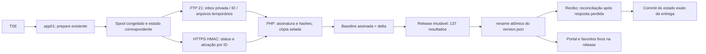

# Publicação FTP: implementação e operação

Estado: branch de revisão, **sem instalação, deploy ou corte**. Serviços, timers e publicadores legados foram preservados. Os comandos operacionais abaixo são referência para uma implantação futura autorizada, não instruções para executar agora.

Atualização da etapa 7: veja [o runbook de migração](ftp-migration-runbook.md) para diagnóstico real, adoção assistida e planos de ativação/recuperação de código. O bloqueio de baseline sem inventário foi resolvido no procedimento/testes locais com certificado privado; a adoção real não foi realizada. O controlador pode adquirir também o lock oficial legado. O idg real numérico é suportado e reabertura de totalização finalizada é bloqueada até revisão. As seções abaixo registram também os limites encontrados na etapa 6; prevalece o runbook para o estado operacional atual.

## Fluxo implementado



`ftp_delivery.py` usa exclusivamente `ftplib.FTP`, porta 21 e modo passivo. Cada arquivo é enviado como `.part`, recuperado para comparação dos bytes e renomeado; `READY` é o último arquivo. Nenhum arquivo eleitoral é transportado pelo controle HTTPS. O ID SHA-256 identifica o descritor canônico que contém baseline, paths, tamanhos e hashes. Uma assinatura HMAC sobre os bytes do descritor autentica a entrega; a existência de READY não é autorização.

`ftp_live_runner.py` é uma entrada opt-in Linux, não conectada aos serviços existentes. Uma fila pendente impede novo prepare. A fila preserva uma cópia do estado correspondente; o recibo é persistido antes da troca desse estado. Um crash entre os renames pode ser reconciliado sem coletar novamente. Estados anteriores e entregas são conservados; nenhuma limpeza automática é executada.

O receptor `election-ftp-control.php` aceita apenas POST HTTPS com HMAC, timestamp e nonce exclusivo. O corpo contém somente `action` e `delivery_id`. Não aceita uploads, destinos, comandos ou executáveis. Reutiliza o arquivo HMAC existente. Configuração externa fixa define o destino. O helper mantém lock exclusivo entre ativação, status e rollback, valida o inventário assinado de toda a baseline e monta outra release completa. Os pares permitidos são os 137 do contrato atual. Valida identidade, contagens, timestamps e manifest frente aos resultados. A seleção pública ocorre somente após validação de todos os arquivos.

A barreira por target persiste identidade da eleição, timestamp da geração da fonte, idg e fingerprint. Geração anterior é rejeitada; alteração ambígua na mesma geração é rejeitada. Uma nova geração pode corrigir votos para baixo. `captured_at` é comparado ao manifest, mas não participa do fingerprint antirregressão. Mudança de eleição/ambiente/turno exige revisão e migração explícita. Não foi inferida ordenação lexical dos idgs TSE.

O marcador é o ponto de commit. Status reconhece a entrega selecionada mesmo sem recibo gravado. Recibos históricos permitem confirmar uma entrega já publicada quando outra a sucedeu. Um rollback operacional posterior exige reconciliar a fila local antes de retomar deltas; não significa que a publicação original falhou.

## Deploy de código no GitHub Actions

`ftp-code-delivery.yml` é manual; chama `deploy-locaweb-ftp.yml`, reutilizável. Só permite main, componentes portal/control e ambientes staging/production. Testa a mesma revisão, empacota arquivos permitidos, arquiva o artefato e transfere por FTP para um destino privado versionado por checksum. Concurrency serializa entregas de código por ambiente; configurar raízes distintas por environment. Não usa `LOCAWEB_FTP_GOIAS_DIR`.

**Limite deliberado:** esse workflow entrega código em inbox; não substitui PHP/frontend em execução. Ativação de código permanece bloqueada até confirmar o layout FTP e o mecanismo de troca de diretórios da hospedagem. Não foi criado endpoint para executar código enviado. O deploy GO e os workflows legados não foram redirecionados nesta branch. A main remota possui workflows financeiros ausentes deste checkout; integrá-los exige revisão de suas versões atuais. Não há exclusividade entre escritores legados e novos até o corte supervisionado.

## Configuração necessária

| Local | Nome | Uso |
| --- | --- | --- |
| GitHub Secrets existentes | `LOCAWEB_FTP_HOST`, `LOCAWEB_FTP_USER`, `LOCAWEB_FTP_PASSWORD` | Reutilizar sem novas credenciais. |
| GitHub vars por environment | `LOCAWEB_FTP_CODE_INBOX_DIR` | Raiz FTP privada para artefatos de código; subpastas portal/control. |
| app01, ambiente protegido | Mesmas credenciais FTP existentes | Provisionar acesso operacional autorizado, nunca registrar valores no Git. |
| app01 | `LOCAWEB_FTP_ELECTION_INBOX_DIR` | Caminho FTP privado das entregas de resultados. |
| app01 | `ELECTION_FTP_CONTROL_URL` | URL HTTPS do endpoint novo; não modificar a URL legada. |
| app01 | `ELECTION_HMAC_KEY_FILE` | Caminho do arquivo existente, hexadecimal de 32 bytes; não nova chave. |
| app01 | `LIVE_PUBLISH_STATE_DIR` | Raiz local existente; fila em `ftp-queue`. Usar outra raiz em staging. |
| Locaweb | `~/.election-publisher/ftp-config.json` | Configuração externa de caminhos e habilitação. |

Formato do arquivo externo, com caminhos **a confirmar**, sem segredos:

```json
{"inbox":"/CAMINHO/PRIVADO/inbox","private":"/CAMINHO/PRIVADO/estado-ftp","public_root":"/CAMINHO/public_html","site":"/CAMINHO/public_html/data","environment":"AMBIENTE_TSE_APROVADO","round":1,"enabled":false}
```

PHP deve ter acesso a inbox, área privada e data; FTP não deve poder modificar área selada, chave, journals ou código em execução. Inbox e estado ficam fora de public_root e separados. Os arquivos internos de estado/configuração não são parte do pacote. Defaults não habilitam ativação. FTP PWD e permissões não foram confirmados.

## Validação local

Pré-requisitos: Python/dependências de desenvolvimento, PHP CLI >= 8.1 (8.4 usado localmente), Bash para a suíte legada, Node para leitores.

```text
python -m pytest -q tests/test_ftp_publication.py
python -m pytest -q
php -l deploy/locaweb/ftp-publication.php
php -l deploy/locaweb/election-ftp-control.php
node --check web/public/eleicoes/app.js
node --check web/public/eleicoes/favorites.js
```

Fixtures produzem 137 resultados sintéticos em diretórios temporários. O motor PHP real é executado em subprocessos; FTP é simulado sem conexões externas. Não há uso de TSE ou PostgreSQL nesses testes. Falhas simuladas não substituem um teste futuro de FTP passivo, rename e interrupções na hospedagem isolada.

Validação local em 09/10/2026: **211 testes passaram; 1 foi excluído**, exclusivamente `test_live_publish_script_has_valid_bash_syntax`. O WSL local não possui Bash e o Git Bash foi bloqueado pela política de execução do Windows; o teste legado permanece inalterado e deve executar no CI Linux. PHP 8.4.26: lint dos dois novos arquivos aprovado. Node 22.14.0: sintaxe app/favorites aprovada e harness real de favoritos aprovado. Comando da suíte: `python -m pytest -q -p no:cacheprovider -k 'not test_live_publish_script_has_valid_bash_syntax'`, com basetemp local isolado. Nenhum deploy ou chamada TSE foi executado. `git diff --check` aprovado.

## Implantação futura e pontos de bloqueio

1. Revisar PR e reconciliar divergências com main remota. Confirmar paths FTP, PHP web, armazenamento/quotas, permissões, exclusividade dos escritores, cache e atomicidade do filesystem. Separar staging e produção com environments protegidos e raízes próprias.
2. Transferir o artefato PHP/frontend validado via workflow para inbox privada; instalação/ativação de código exige procedimento próprio aprovado, backup e verificação. Não usar o workflow como upload direto sobre produção. Atualizar leitores antes dos dados; versões dos assets foram incrementadas.
3. Configurar staging com chave existente e paths privados isolados. Ativação inicialmente desabilitada; autorizar habilitação somente no staging. Primeiro ciclo usa raiz live vazia e bundle completo. Entrada futura: `python -m collector.src.ftp_live_runner`. Esse comando consulta o TSE configurado: só executar com fixture/simulador autorizado em staging.
4. Testar FTP real e controle no staging, inclusive timeout após ativação, interrupção, disco cheio, rollback e cache. Confirmar por leitura pública o marcador, os 137 hashes e o comportamento no navegador. A implementação não usa GET público como condição automática do commit; exige recibo do controle autenticado. Validar caches antes do corte.
5. **Bloqueio para produção existente:** baseline legada não contém inventário assinado; estado live existente não possui recibo FTP. O runner recusa iniciar nessa situação e o receptor rejeita baseline sem inventário. Não apagar state nem version.json para contornar. Preparar migração assistida, com cópia isolada da release atual e comparação integral com estado local, produzir inventário assinado e watermarks validados e registrar baseline local sob autorização específica. Essa adoção não foi automatizada para evitar certificar conteúdo não reconciliado.
6. Somente após resolver essa adoção e autorizar corte: garantir ausência de escritor legado, instalar entrada nova e observar vários ciclos. Esta branch não edita unidades, overrides ou timers. O lock novo não coordena publicadores legados. Se exclusividade não estiver comprovada, não habilitar o fluxo novo.

## Rollback e retenção

Controle autenticado `rollback` recebe o ID da entrega atual e permite exclusivamente o marcador anterior registrado no journal dessa entrega. Confere inventário/hashes do alvo, bloqueia se a entrega não for a corrente, troca marcador atomicamente e gera nova activation_revision. Repetir o mesmo rollback é idempotente. Watermarks não são reduzidos. Não existe rollback da primeira publicação sem baseline anterior.

Com autorização futura, a API Python `Control(url, key).request("rollback", delivery_id)` envia apenas controle. Depois verificar site/137 resultados, reconciliar state/fila do app01 e baseline antes da próxima entrega. Não editar manualmente a versão nem apagar a barreira de fonte. Se o alvo estiver corrompido, rollback é rejeitado e o marcador corrente é preservado.

Código: conservar artefato anterior e backup verificável; ativação e reversão de diretórios exigem validação específica do layout real. Não improvisar restauração arquivo a arquivo sobre aplicação em execução. O antigo serviço permanece disponível até corte autorizado, mas não deve concorrer com FTP.

Retenção conservadora: todas as releases, journals, recibos, estados e entregas são mantidos. Ainda não há garbage collection/quota automática. Monitorar espaço e realizar limpeza futura aprovada sob lock, preservando ativa, anterior e entregas em voo. Erros antes da troca deixam builds órfãos sem seleção pública. Backups de estado privado e marcador são necessários para perda de disco.

## Riscos pendentes

- Bloqueadores: adoção da baseline real, ativação segura do código na hospedagem e exclusividade com legado. Não considerar o sistema pronto para corte automático.
- PHP web/FTP privado, rename sobrescrevendo temporários, locks e cache não comprovados na Locaweb. Fsync de arquivos não prova durabilidade dos renames de diretórios após perda de energia.
- Armazenamento cresce sem limpeza automática; tamanho por arquivo limitado a 16 MiB e 140 arquivos por entrega, mas faltam quotas globais.
- FTP sem criptografia permanece por decisão explícita. Assinatura protege resultados somente se chave/área selada/código não forem acessíveis pela conta FTP.
- Antirregressão usa timestamp de fonte validado e falha fechada em ambiguidade; semântica de idg e timestamps em correções reais precisa validação operacional.
- A fila interrompe novas preparações até reconciliar a entrega pendente. Alertar para fila envelhecida; retenção/freshness ainda requer integração operacional.
- Actions concurrency cobre somente os novos jobs; escritores GO/legados não estão migrados nem coordenados globalmente.
